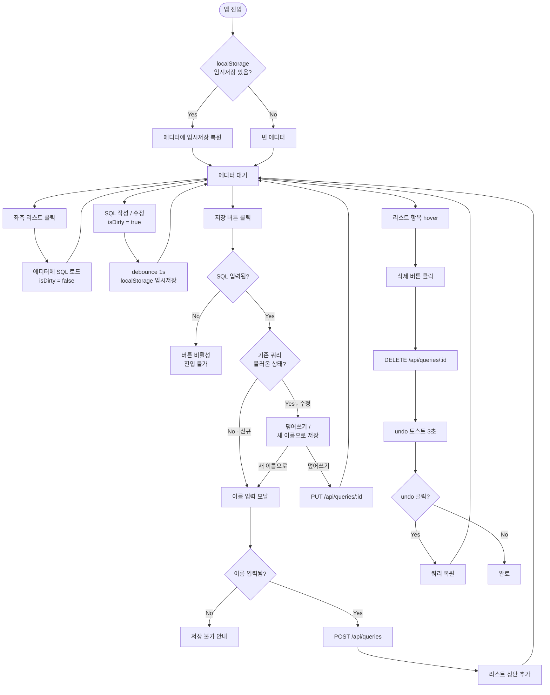
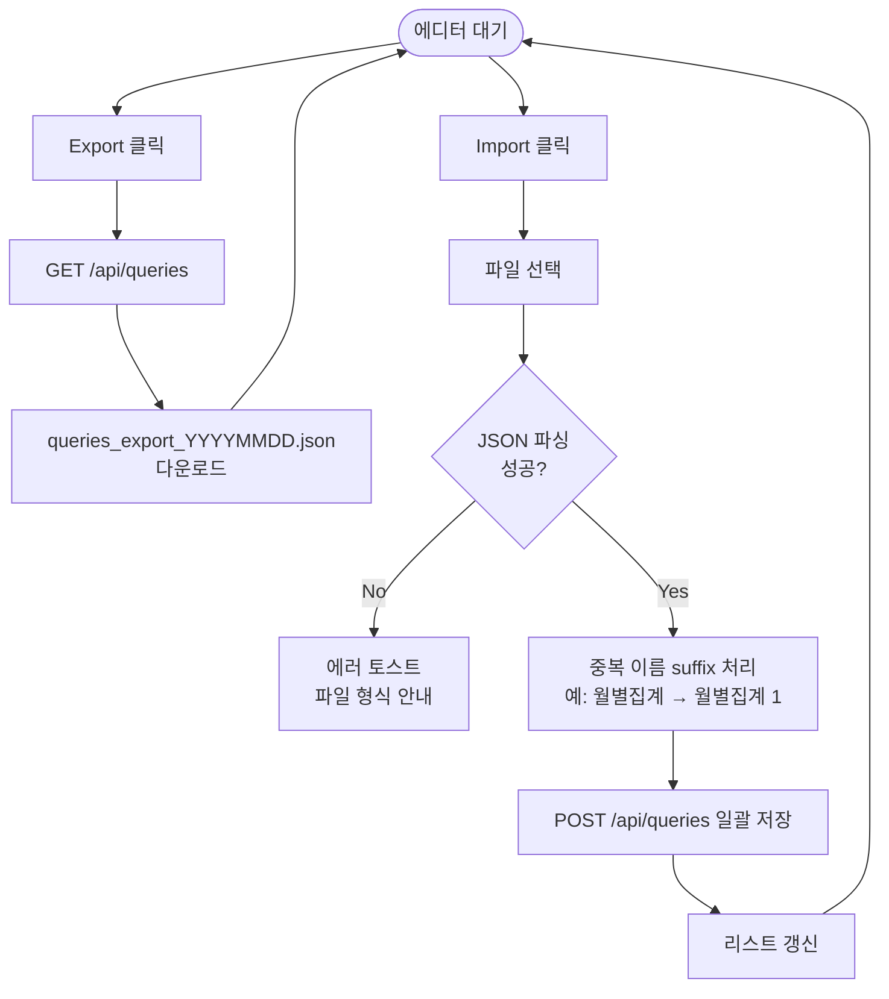
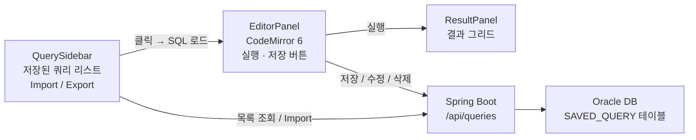
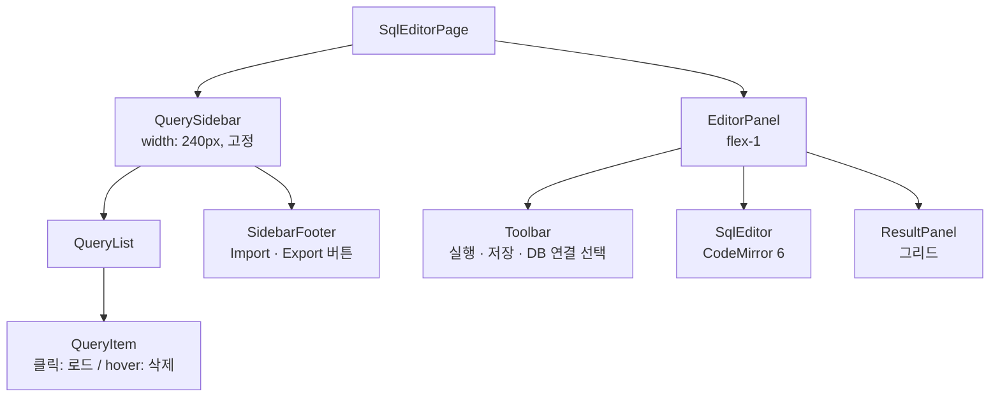

# PRD: SQL 에디터 — 쿼리 저장 및 관리

> 버전: v0.2 | 상태: Draft

---

## 1. 개요

### 문제 정의

DB 콘솔에서 자주 사용하는 쿼리를 매번 다시 작성해야 하고, 작성한 쿼리를 체계적으로 보관할 수 없어 반복 작업이 발생한다.

### 제안 솔루션

사용자가 작성한 SQL을 이름을 붙여 서버에 저장하고, 좌측 리스트에서 클릭 한 번으로 불러올 수 있는 쿼리 관리 기능을 제공한다. 추가로 JSON 파일로 Export/Import하여 백업 및 공유가 가능하다.

---

## 2. 사용자 및 기능 요구사항

### 사용자 페르소나

주 사용자는 서비스개발실 내부 개발자 및 DB 접근 권한이 부여된 담당자. 폐쇄망 사내 환경에서 Oracle DB 대상으로 쿼리를 작성하고 실행한다.

---

### 유저 스토리

저장 — As a 사용자, I want to 작성한 SQL에 이름을 붙여 서버에 저장하고 싶다. so that 다음에도 같은 쿼리를 빠르게 불러올 수 있다.

불러오기 — As a 사용자, I want to 좌측 리스트에서 저장된 쿼리를 클릭하고 싶다. so that 에디터에 즉시 로드하여 바로 실행할 수 있다.

수정 저장 — As a 사용자, I want to 불러온 쿼리를 수정한 뒤 덮어쓰거나 새 이름으로 저장하고 싶다. so that 쿼리를 버전 관리하듯 유지할 수 있다.

삭제 — As a 사용자, I want to 필요 없는 저장 쿼리를 삭제하고 싶다. so that 리스트를 깔끔하게 유지할 수 있다.

Export — As a 사용자, I want to 저장된 쿼리 목록을 JSON 파일로 내보내고 싶다. so that 백업하거나 동료에게 공유할 수 있다.

Import — As a 사용자, I want to JSON 파일을 업로드하여 쿼리를 일괄 등록하고 싶다. so that 다른 환경의 쿼리를 그대로 가져올 수 있다.

---

### 완료 기준 (Acceptance Criteria)

**저장**

- 에디터에 SQL이 1자 이상 입력된 상태에서 [저장] 버튼 활성화
- 저장 시 이름 입력 모달 노출
- 이름 미입력 시 저장 불가 + 안내 메시지 표시
- 저장 성공 시 좌측 리스트 상단에 즉시 추가
- 에디터 내용은 localStorage에 임시저장되어 새로고침 후 복원됨

**불러오기**

- 리스트 항목 클릭 시 에디터에 해당 SQL 즉시 로드
- 현재 로드된 쿼리 항목은 리스트에서 활성 표시

**수정 저장**

- 불러온 쿼리 수정 후 [저장] → "덮어쓰기 / 새 이름으로 저장" 선택
- 덮어쓰기 시 서버의 기존 항목 업데이트

**삭제**

- 리스트 항목에 삭제 버튼 노출 (hover 시)
- 삭제 즉시 처리 + undo 토스트 3초 제공

**Export**

- [Export] 클릭 시 `queries_export_YYYYMMDD.json` 파일 다운로드
- JSON 포맷: `[{ name, sql, createdAt }]`

**Import**

- [Import] 클릭 시 파일 선택 → JSON 파싱 → 서버 일괄 저장
- 중복 이름 처리: 이름 뒤에 `(1)`, `(2)` 자동 suffix
- 파싱 실패 시 에러 토스트 표시

---

### Non-Goals (이번 버전 제외)

쿼리 버전 히스토리, 쿼리 공유/권한별 접근 제어, 폴더/태그 분류, 검색 기능, 실행 결과 함께 저장

---

## 3. 유저 플로우

### 3-1. 핵심 플로우 — 저장 / 불러오기 / 수정 / 삭제



---

### 3-2. Export / Import 플로우



---

## 4. 기술 명세

### 아키텍처 개요



### 컴포넌트 구조



### API 명세

| Method | Path               | 설명           |
| ------ | ------------------ | -------------- |
| GET    | `/api/queries`     | 전체 목록 조회 |
| POST   | `/api/queries`     | 신규 저장      |
| PUT    | `/api/queries/:id` | 덮어쓰기       |
| DELETE | `/api/queries/:id` | 삭제           |

**Request Body (POST/PUT)**

```json
{
  "name": "월별 계약 집계",
  "sql": "SELECT * FROM CONTRACT WHERE ..."
}
```

**Response (GET)**

```json
[
  {
    "id": 1,
    "name": "월별 계약 집계",
    "sql": "SELECT * FROM CONTRACT WHERE ...",
    "createdAt": "2025-03-24T09:00:00"
  }
]
```

### DB 스키마

```sql
CREATE TABLE SAVED_QUERY (
  ID          NUMBER          PRIMARY KEY,
  NAME        VARCHAR2(100)   NOT NULL,
  SQL_TEXT    CLOB            NOT NULL,
  CREATED_BY  VARCHAR2(50),
  CREATED_AT  TIMESTAMP       DEFAULT SYSDATE,
  UPDATED_AT  TIMESTAMP
);
```

### 프론트엔드 상태 구조

```ts
interface SavedQuery {
  id: number
  name: string
  sql: string
  createdAt: string
}

interface EditorState {
  currentSql: string
  loadedQueryId: number | null // 현재 로드된 쿼리 ID
  isDirty: boolean // 로드 후 수정 여부
}
```

### 보안 / 데이터 처리

저장 쿼리는 SSO 사용자 기준으로 조회. SQL_TEXT는 CLOB 저장하되 렌더링 시 텍스트로만 처리(XSS 방지). Export 파일에 접속 정보 미포함.

---

## 5. 리스크 및 로드맵

### 단계별 출시 계획

| 단계 | 범위                                           | 목표 일정 |
| ---- | ---------------------------------------------- | --------- |
| MVP  | 저장 / 불러오기 / 삭제 + localStorage 임시저장 | TBD       |
| v1.1 | 덮어쓰기 / Export / Import                     | TBD       |
| v1.2 | 검색 / 태그 분류                               | TBD       |

### 기술 리스크

| 리스크                     | 가능성 | 영향도 | 대응                                     |
| -------------------------- | ------ | ------ | ---------------------------------------- |
| SQL_TEXT CLOB 길이 초과    | 낮음   | 중간   | 저장 전 길이 체크 + 안내 (최대 1MB 제한) |
| Import 시 대량 중복 이름   | 중간   | 낮음   | suffix 자동 처리로 무중단                |
| localStorage 임시저장 유실 | 낮음   | 낮음   | MVP 이후 서버 자동저장 검토              |
